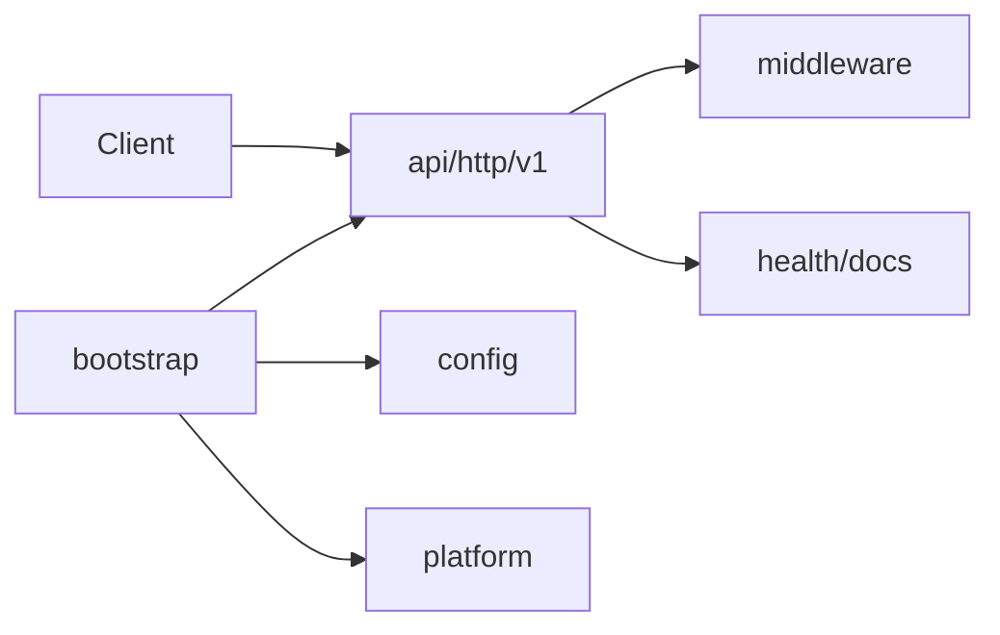
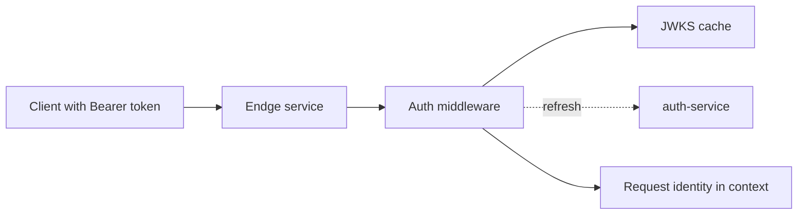
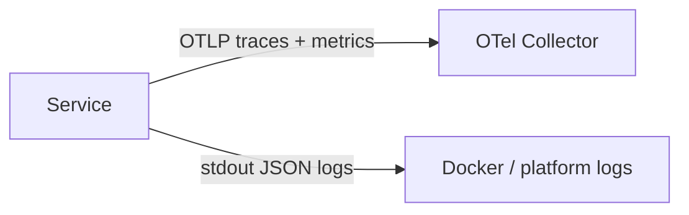
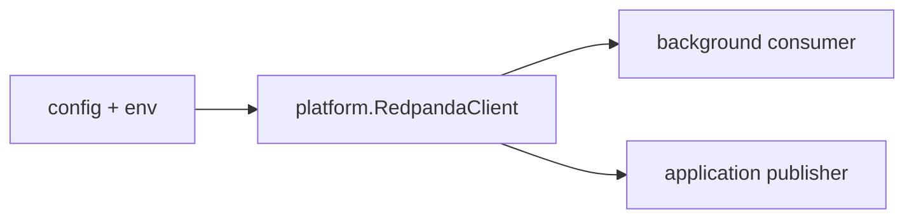
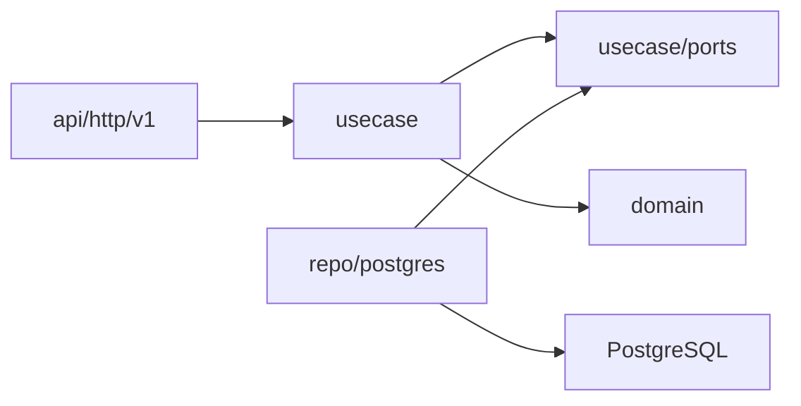

# Endge Service Template Architecture

Этот файл описывает минимальный production-ready скелет нового Endge microservice.

## 1. Роль шаблона

Template не содержит бизнес-фич. Его задача - дать сервису готовую инфраструктурную основу:

- runtime config;
- HTTP server;
- middleware;
- health/version endpoints;
- docs endpoint;
- auth middleware;
- telemetry;
- logger;
- optional platform clients.

Бизнесовые usecase, repositories и migrations добавляются только в конкретном сервисе.

## 2. Базовая структура



Обязательные правила:

- `internal/api/http/v1` содержит transport слой и маршруты;
- `internal/bootstrap` собирает приложение через `fx`;
- `internal/config` является тонкой оберткой над `service-kit-go/config`;
- `internal/platform` содержит интеграции уровня runtime, например Redpanda client;
- `internal/domain/errors` содержит общий error contract;
- бизнесовые слои не создаются в template заранее.

## 3. HTTP

Template регистрирует:

```text
GET /health
GET /version
GET /swagger
GET /swagger/openapi3.yaml
```

Новые бизнесовые endpoints должны добавляться под:

```text
/api/v1
```

## 4. Auth flow



Правила:

- auth выключен по умолчанию;
- JWT валидируется локально через JWKS;
- на каждый запрос не делается remote introspection;
- конкретный сервис сам решает, какие `/api/v1` routes защищать auth middleware.

## 5. Ошибки

Все HTTP-ошибки должны возвращаться в едином формате:

```json
{
  "code": "common.not_found",
  "message": "Сущность не найдена",
  "details": {}
}
```

Стабильный внешний маппинг:

- `ErrInvalidInput` -> `400`;
- `ErrUnauthorized` -> `401`;
- `ErrForbidden` -> `403`;
- `ErrNotFound` -> `404`;
- `ErrConflict` -> `409`;
- `ErrInternal` -> `500`.

## 6. Telemetry и logging



Правила:

- traces и metrics идут в `OTEL_EXPORTER_OTLP_ENDPOINT`;
- логи остаются в `stdout`;
- входящий `traceparent` или `baggage` должен продолжать существующий trace;
- недоступность collector не должна ломать обработку запросов.

## 7. Redpanda и event bus



Правила:

- Redpanda выключена по умолчанию;
- Kafka-compatible runtime живет в `internal/platform`;
- topic names задает конкретный сервис, не template.

## 8. Бизнес-слои

Когда сервису нужна предметная логика, добавляйте ее явно:



Правила:

- usecase слой владеет orchestration и transaction boundary;
- ports описывают потребности usecase слоя;
- repo/postgres реализует ports;
- HTTP не должен ходить напрямую в repo/postgres;
- domain не должен знать про HTTP, middleware и Postgres.

## 9. OpenAPI

Контракт шаблона живет в:

```text
docs/openapi3.yaml
```

Этот файл должен оставаться минимальным, пока в сервисе нет бизнес API.

## 10. Тестовая стратегия

Template проверяет:

- компиляцию;
- общие domain errors;
- platform clients в disabled/enabled режимах;
- package naming;
- отсутствие старых reference-фич;
- наличие технического OpenAPI.

Конкретный сервис должен добавить свои unit, integration, contract и e2e tests вместе с бизнес-логикой.
