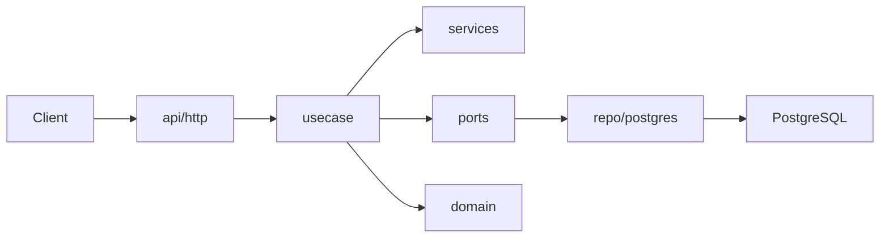
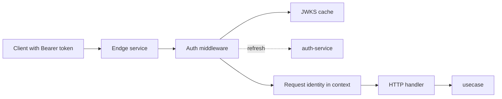
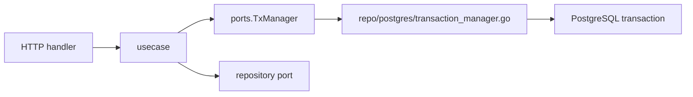
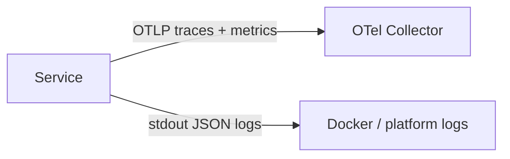
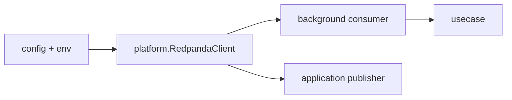

# Endge Service Template Architecture

Этот файл описывает production-стандарт нового Endge-сервиса поверх шаблона.

## 1. Роль сервиса

Каждый сервис из шаблона предполагается как отдельный business-service:

- со своей PostgreSQL-базой
- со своим HTTP API
- со своим доменом
- с общей auth-моделью через `auth-service`
- с общей telemetry-моделью через `otel-collector`

## 2. Слои

Правила:

- `domain` не знает про HTTP, Postgres и middleware
- `usecase` владеет orchestration и transaction boundary
- `ports` описывает, что application layer хочет от внешнего мира
- `repo/postgres` реализует эти контракты

## 3. Домен

`internal/domain` делится на три части:

- `entities` для сущностей
- `valueobjects` для значимых значений с инвариантами
- `errors` для бизнесовых и application-level ошибок

Пример из шаблона:

- `Todo`
- `TodoTitle`
- `ErrInvalidTodoTitle`

## 4. Auth flow

Правила:

- JWT валидируется локально
- на каждый запрос не делаем remote introspection
- handler работает уже с готовой identity из context

## 5. Transaction flow

Правила:

- транзакцией владеет `usecase`
- репозиторий не открывает бизнес-транзакцию самовольно
- конкретная реализация транзакции остается инфраструктурной деталью

## 6. Ошибки

Распределение ошибок:

- transport parsing/validation errors живут на HTTP boundary
- доменные и application-level ошибки живут в `internal/domain/errors`
- неожиданные infrastructure errors логируются и маппятся в безопасный `500`

Стабильный внешний маппинг:

- `ErrInvalidInput` -> `400`
- `ErrNotFound` -> `404`
- `ErrConflict` -> `409`

## 7. Telemetry и logging

Правила:

- traces и metrics идут в `OTEL_EXPORTER_OTLP_ENDPOINT`
- логи остаются в `stdout`
- входящий `traceparent` или `baggage` должен продолжать существующий trace; если upstream-контекста нет, сервис начинает новый trace сам
- недоступность collector не должна ломать обработку запросов
- сервис не должен делать удаленный вызов на каждый лог
- reference-поток шаблона должен показывать child spans и trace-aware логи в `api/http`, `auth`, `usecase`, `services` и `repo/postgres`

## 8. RedPanda и event bus

Правила:

- Kafka-compatible runtime живет в `internal/platform`, а не внутри handler/use case;
- список брокеров, client id и таймауты задаются через `REDPANDA_*`;
- конкретные topic names задаёт сервисный конфиг, а не template;
- сервисные ingestion-потоки должны быть идемпотентны и готовы к повторной доставке сообщений.

## 9. Scalar и контракт

Контракт должен жить в двух местах одновременно:

- `docs/openapi.yaml`
- OpenAPI-комментарии в `api/http`

Это позволяет:

- быстро читать checked-in контракт
- держать endpoint description рядом с кодом
- не терять документацию при расширении сервиса

## 10. Тестовая стратегия

Шаблон ожидает четыре уровня проверки:

- unit tests рядом с `domain`, `services`, `usecase`
- architecture tests для package naming, layer boundaries и required skeleton
- `test/integration` для реальной БД и repo adapters
- `test/contract` для HTTP-контракта
- `test/e2e` для полного user flow

Отдельно для event-driven сервисов шаблон ожидает:

- unit tests на нормализацию входящих Kafka command payload-ов;
- integration tests на persistence/fanout слой;
- contract tests на HTTP receipts и polling;
- e2e-сценарии с ingest -> fanout -> client ack/dismiss.

## 11. Todo как reference-feature

`Todo` в шаблоне специально сделан как минимальный, но production-pattern пример:

- одна сущность
- один value object
- один набор доменных ошибок
- один сервис
- один порт репозитория
- один `TxManager`
- один use case
- один transport endpoint

Если новая фича не укладывается в этот pipeline, сначала нужно понять, это правда особый случай или мы начинаем размывать архитектурный стандарт.
